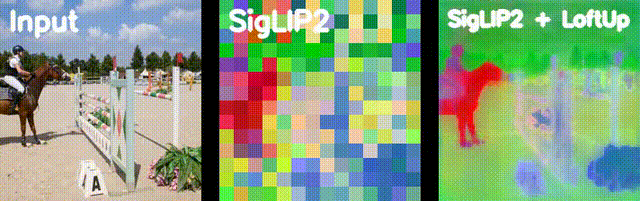
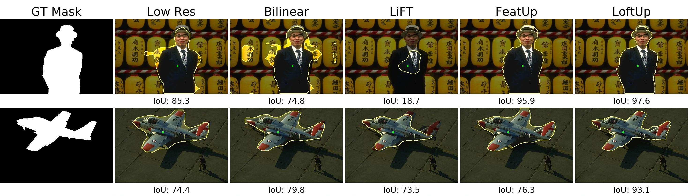

# Publications

  
ICCV 2025 [Oral]

  <h3>LoftUp: Learning a Coordinate-Based Feature Upsampler for Vision Foundation Models</h3>
  
Haiwen Huang, Anpei Chen, <strong class="author-self">Volodymyr Havrylov</strong>, Andreas Geiger, Dan Zhang

  
  <input type="checkbox" id="abs-1" class="abstract-toggle">
  <label for="abs-1" class="abstract-label">>> View Abstract</label>
  

  Vision foundation models (VFMs) such as DINOv2 and CLIP have achieved impressive results on various downstream tasks, but their limited feature resolution hampers performance in applications requiring pixel-level understanding. Feature upsampling offers a promising direction to address this challenge. In this work, we identify two critical factors for enhancing feature upsampling: the upsampler architecture and the training objective. For the upsampler architecture, we introduce a coordinate-based cross-attention transformer that integrates the high-resolution images with coordinates and low-resolution VFM features to generate sharp, high-quality features. For the training objective, we propose constructing high-resolution pseudo-groundtruth features by leveraging class-agnostic masks and self-distillation. Our approach effectively captures fine-grained details and adapts flexibly to various input and feature resolutions. Through experiments, we demonstrate that our approach significantly outperforms existing feature upsampling techniques across various downstream tasks. 
  

  

    
  

  
  

    <a href="https://arxiv.org/abs/2504.14032" class="mono yellow" target="_blank" rel="noopener noreferrer">[arXiv]</a> <a href="https://andrehuang.github.io/loftup-site/" class="mono yellow" target="_blank" rel="noopener noreferrer">[Project]</a> <a href="https://github.com/andrehuang/loftup" class="mono yellow" target="_blank" rel="noopener noreferrer">[Code]</a>
  

  
 [ILR+G Workshop](https://iccv.thecvf.com/virtual/2025/workshop/2744) @ ICCV 2025 [Oral]

  <h3>Benchmarking Feature Upsampling Methods for Vision Foundation Models using Interactive Segmentation</h3>
  
<strong class="author-self">Volodymyr Havrylov</strong>, Haiwen Huang, Dan Zhang, Andreas Geiger

  
  <input type="checkbox" id="abs-2" class="abstract-toggle">
  <label for="abs-2" class="abstract-label">>> View Abstract</label>
  

  Vision Foundation Models (VFMs) are large-scale, pre-trained models that serve as general-purpose backbones for various computer vision tasks. As VFMs' popularity grows, there is an increasing interest in understanding their effectiveness for dense prediction tasks. However, VFMs typically produce low-resolution features, limiting their direct applicability in this context. One way to tackle this limitation is by employing a task-agnostic feature upsampling module that refines VFM features resolution. To assess the effectiveness of this approach, we investigate Interactive Segmentation (IS) as a novel benchmark for evaluating feature upsampling methods on VFMs. Due to its inherent multimodal input, consisting of an image and a set of user-defined clicks, as well as its dense mask output, IS creates a challenging environment that demands comprehensive visual scene understanding. Our benchmarking experiments show that selecting appropriate upsampling strategies significantly improves VFM features quality.
  

  

    
  

  

    <a href="https://arxiv.org/abs/2505.02075v1" class="mono yellow" target="_blank" rel="noopener noreferrer">[arXiv]</a> <a href="https://github.com/havrylovv/iSegProbe" class="mono yellow" target="_blank" rel="noopener noreferrer">[Code]</a>
  

  
J. MOL. STRUCT

  <h3>Protein structure effect on optical absorption</h3>
  
Tetiana Afanasieva, <strong class="author-self">Volodymyr Havrylov</strong>, Serhii Mamilov

  
  <input type="checkbox" id="abs-3" class="abstract-toggle">
  <label for="abs-3" class="abstract-label">>> View Abstract</label>
  

    Study of protein structure influence on optical absorption spectra of oxyhemoglobin using hybrid QM/MM methodology...
  

---

# Awards & Honors

  
DAAD

  <h3>DAAD Scholarship for Master Studies</h3>
  
2022 – 2024

  
Awarded in recognition of academic excellence and strong research potential.

